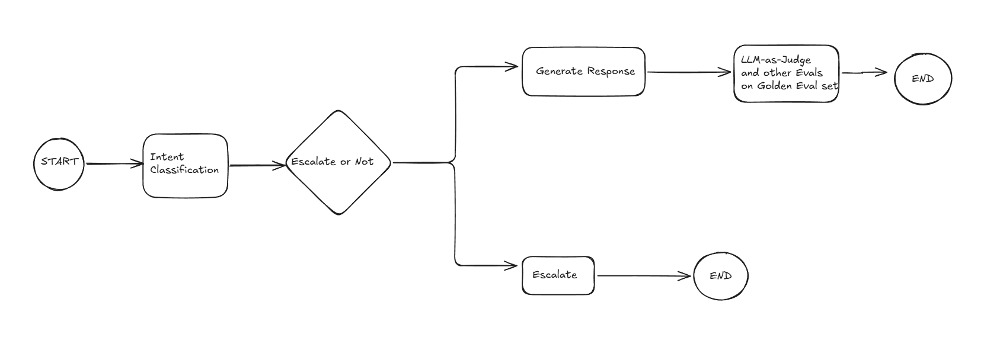

# AI Support Agent - AppleSupport
An agent that classifies incoming customer tweets, drafts a reply grounded in how the
brand has historically resolved similar issues, and decides whether to auto-handle or
escalate to a human. 
Built on the [Customer Support on Twitter](https://www.kaggle.com/datasets/thoughtvector/customer-support-on-twitter)
dataset, filtered to the `AppleSupport` brand.

## Flow


### Design Decisions
- Fine-tuned BERT for intent Classification
- Multi-factor escalation logic (BERT confidence + RAG retrieval score + sentiment threshold)
- RAG pipeline for LLM reply generaton
- LangGraph for orchestrating the pipeline

## Quick start - reproduce in under 15 minutes

This assumes you already have a trained intent model in `models/intent_classifier/`
and a built RAG index in `models/rag_index/`. Fine-tuning BERT and clustering 40k tweets are one-time, offline steps - they are not part of the
15-minute reproduction path.

```bash
git lfs install
git clone https://github.com/atomiclifestyle/ai-support-agent.git
cd ai-support-agent
python -m venv .venv && source .venv/bin/activate
pip install -r requirements.txt

cp .env.example .env
# put your Groq API key in .env

streamlit run app.py
```

## Notes
- Sampling is capped at `MAX_SAMPLE_ROWS` (default 40k rows of the raw CSV) so the
  full pipeline runs on a laptop without needing the entire ~3M-row dataset.

### Golden Evaluation Set - Sampling Stratergy Notes
- **Stratification:** Sample evenly across common intent types (e.g., 20% billing, 30% technical, 30% shipping, 20% general inquiries).
- **Edge Case Inclusion:** Ensure ~15% of samples contain noisy input (slang, multi-part questions, high emotional urgency/anger) to stress-test escalation. 
